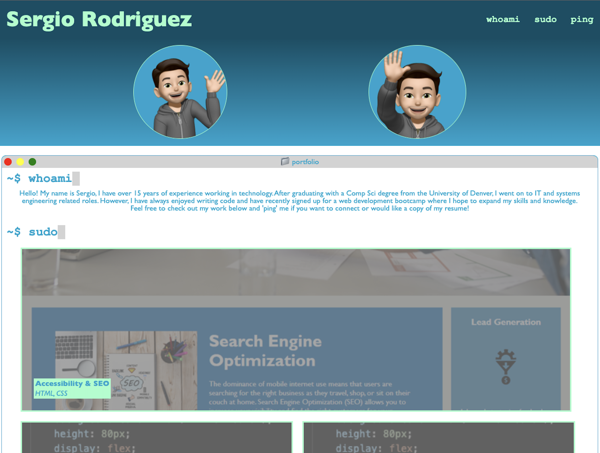
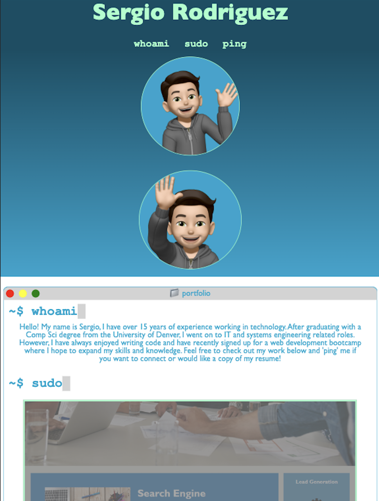
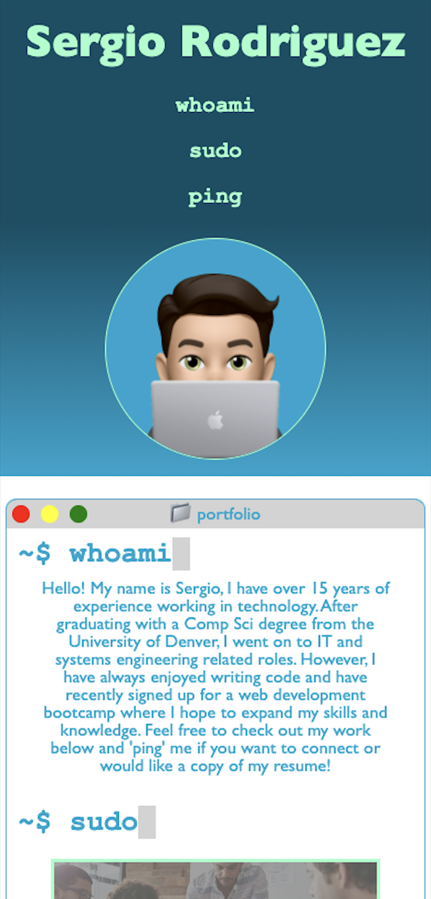

# Challenge 02 - Portfolio

## Project Description

I created a portfolio to showcase my work to potential employers and peers in a centralized location. Even though this is a first version of my professional portfolio, I will continue to make improvements to it with what I learn in the bootcamp.

I used the HTML and CSS knowledge I have gained so far to create my portfolio. However, the two most important things I learned while working on this project are:

1. COMMIT COMMIT COMMIT! When using `git`, committing your code is just as important as saving your Word documents. I came across an issue where I accidentally deleted a piece of code from my CSS file. When I went to check my `git` commits in GitHub, I couldn't find the piece of code I lost. Rewriting the code wasn't a big undertaking but I have learned my lesson - commit often!
2. I was having a bit of difficulty understanding the concept of the `flexbox` so I made it a point to play with the code as I built the portfolio. I can't say that I'm an expert on this topic but I feel more comfortable with it now than I did when I first learned it.

I am very pleased with the end result. The idea to design my portfolio as if it were a collection of Linux commands in a Terminal window came to me when I was 80% finished with the project. I didn't think I would spend a lot of time on the design aspect itself but seeing the final product slowly come to life pushed me to implement a lot more design elements in it.

## Table of Contents
- [User Story](#user-story)
- [Acceptance Criteria](#acceptance-criteria)
- [Links](#links)
- [Screenshots](#screenshots)
    - [Desktop](#desktop)
    - [Tablet](#tablet)
    - [Mobile](#mobile)

## User Story

```
AS AN employer
I WANT to view a potential employee's deployed portfolio of work samples
SO THAT I can review samples of their work and assess whether they're a good candidate for an open position
```

## Acceptance Criteria

```
GIVEN I need to sample a potential employee's previous work
WHEN I load their portfolio
THEN I am presented with the developer's name, a recent photo or avatar, and links to sections about them, their work, and how to contact them
WHEN I click one of the links in the navigation
THEN the UI scrolls to the corresponding section
WHEN I click on the link to the section about their work
THEN the UI scrolls to a section with titled images of the developer's applications
WHEN I am presented with the developer's first application
THEN that application's image should be larger in size than the others
WHEN I click on the images of the applications
THEN I am taken to that deployed application
WHEN I resize the page or view the site on various screens and devices
THEN I am presented with a responsive layout that adapts to my viewport
```

## Links

To access the code repository and live website, use the links below:

- ### GitHub Repository URL
    https://github.com/sergiorodriguezdev/chl-02-portfolio
- ### GitHub Pages URL
    https://sergiorodriguezdev.github.io/chl-02-portfolio/

## Screenshots

### Desktop



### Tablet


### Mobile
